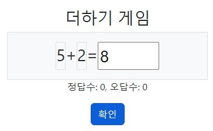
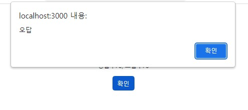

  <h2>더하기 게임</h2>
  <h3>주요 기능 소개</h3>
  <ul>
    <li>게임(앱)이 실행되면 문제 출제 후 초기화되고 랜덤번호를 각 각 생성</li>
    <li>사용자 입력값과 더하기 값이 일치하면 '정답' / 아니면 '오답' 경고창 띄우기</li>
    <li>정답 수, 오답 수 체크 기능 추가</li>
    <li>useState, useEffect 사용 </li>
    <li>부트스트랩을 활용한 css</li>
  </ul>
  

  
산출물 이미지

  
  
